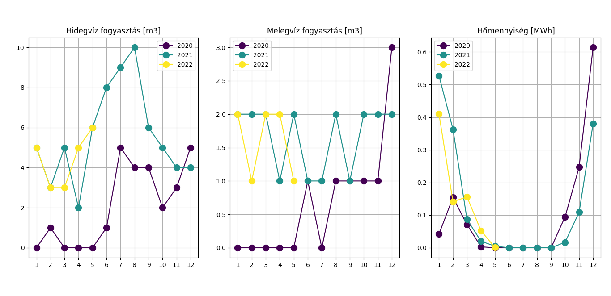

# Hema Home Fogyasztás Ábrakészítő / Consumption Plotting

A program segítségével lehetséges a Hema-Home-tól kapott havi értesítőkből a hideg- és melegvíz valamint a
hőmennyiségmérő adatainak éves, illetve havi bontásban. Ehhez elég az összes fájlt az input mappába másolni.

Plot your cold and warm water consumption and heat loss monthly and year by year by just copying your monthly documents
into the input folder.

## Használat / Usage
* Installáld a szükséges csomagokat: `pip install -r requirements.txt`
* Másold a pdf-eket az `src/inbox` mappa alá
* Futtasd a `python3 src/consumption_plotter.py` fájlt
* Kész az eredmény

* Install the required packages: `pip install -r requirements.txt`
* Copy the PDFs under the src/inbox folder
* Run `python3 src/consumption_plotter.py`
* See the results

## Minta / Example output

